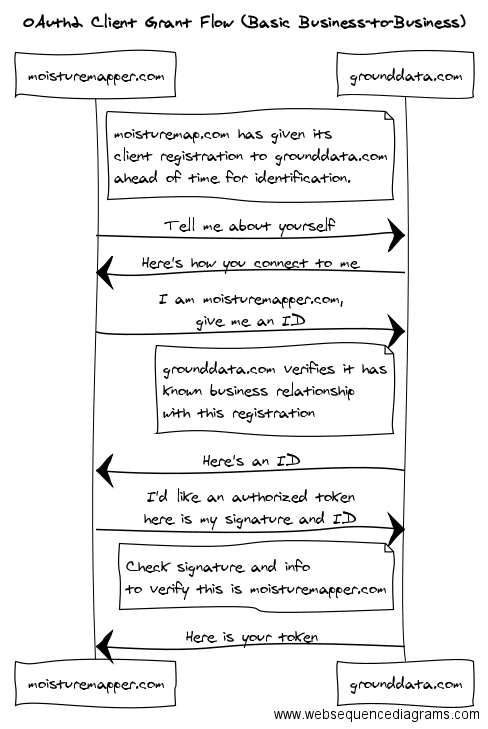

# Business-to-Business: Field Sensor Data Transfer Authorization Use Case (OAuth2 Client Grant Flow)

grounddata.com has a fleet of weather stations deployed across the Midwest, each connected
to their cloud infrastructure, streaming real-time weather conditions and records.  They sell
access to this data to other organizations who need such information.  

moisturemapper.com is an online service that tracks hourly soil moisture for farmers,
giving them predictions on field conditions and optimal plans for cropping operations.
moisturemapper.com would like to purchase real-time, ground-based soil moisture and 
rainfall data from grounddata.com.  

## Salient Features for Authorization:
* There is no user at time of token request which will authorize the token.
* Both companies have created an agreement ahead of time which will eventually require
  an authorization token to be handed out.
* moisturemapper.com is capable of keeping a private key secret on its systems.

## Field Sensor Data Authorization Flow - OAuth2 "Client Grant"
This example shows how one company can authorize another company's systems to access data.

The main goal with this flow is for grounddata.com to reliably know that a request for a token
is coming from moisturemapper.com without the need for a shared secret since all other
OAuth2 flows within OADA already provide for an improved mechanism of identification.

Once a business relationship has been formed, moisturemapper.com needs to give it's
OADA client registration document to grounddata.com.  That document contains information
about where to find the proper public key for moisturemapper.com, which in the end is
the means by which grounddata.com will know that a request for token came from the 
correct moisturemapper.com.  grounddata.com stores this known correct client registration 
document for moisturemapper.com in it's internal systems.

When moisturemapper.com needs to request an authorized token, its systems will
send their client registration to grounddata.com's registration endpoint.  This 
results in a temporary `client_id` given to moisturemapper.com for subsequent
token requests.  At this point, grounddata.com does not know that it is actually
moisturemapper.com which actually sent the client registration document.

moisturemapper.com now makes a regular OAuth2 request for a token with the
temporary `client_id` it was given.  This request uses a signed `jwt_bearer`
as proof that moisturemapper.com has the proper private key.  The `jwt_bearer`
also contains other information to ensure it only belongs to this particular
request for a token and cannot be reused or replayed.

grounddata.com responds with an authorized token which moisturemapper.com 
can now use to request data. 

The following diagram shows the client grant authorization flow in human-readable terms:

