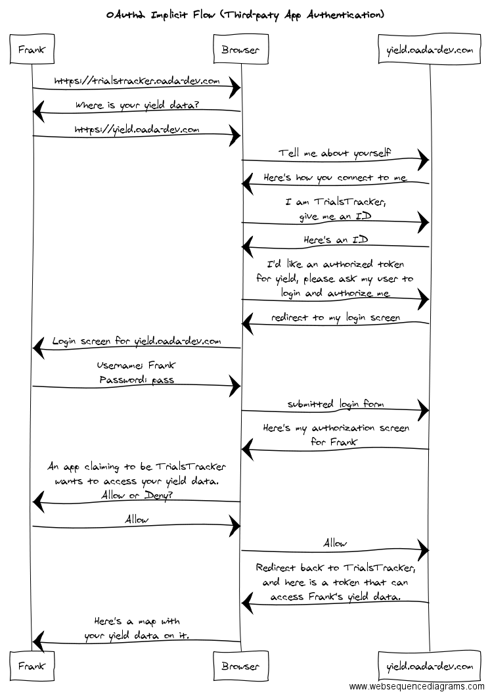

# Business-to-Customer: TrialsTracker Authorization Use Case (OAuth2 Implicit Flow)

[Full Description of TrialsTracker here](https://docs.google.com/document/d/1ZokZf_sWLIUUK0bJzCNiMZ644_xL-wpHUYWhn2NVlV0/edit?usp=sharing)
and [TrialsTracker code is here](https://github.com/openatk/TrialsTracker).
[Try TrialsTracker yourself here](https://trialstracker.oada-dev.com).  You
can use the demo yield data at [https://yield.oada-dev.com](https://yield.oada-dev.com) to see this authorization procedure
in action with a demo username `frank` and password `pass`. 

TrialsTracker is an open source mobile app (web and native) that lets a farmer draw polygons on
maps of his fields and take notes about them during the season (manganese deficiency here, applied different
fungicide rate here, ...).  It can store those notes in an OADA-conformant cloud service to sync across
all employees and consultants on his farm.  Then, as harvest begins, he can point the app at an OADA-conformant 
service which holds his yield data in the cloud, and the app will download that data to provide stats for
those polygons.

In other words, during harvest, TrialsTracker can show the yield difference between all the areas he took notes
on during the season and during harvest.

## Salient Features for Authorization:
* TrialsTracker stores all its data locally (in the browser or app) and has no backend 
  which can keep a private key private
* TrialsTracker need not have any _apriori_ relationship with the farmer's cloud storage service

## TrialsTracker Authorization Flow - OAuth2 "Implicit Grant"
This example shows how a generic third-party app like TrialsTracker can be authorized
to the farmer's cloud storage platform.

In this case, TrialsTracker has no backend cloud that can hold a private authorization key: it is 
just the app, either served via a webpage or as a native mobile app on iOS or Android.
The app intends to use the farmer's cloud storage service for storage which is why the farmer 
wants to connect the app to his cloud storage in the first place.
This means there is no secure means for the app to keep a secure private key which can
identify it to the cloud because it's code resides on the client's device: this is the 
_OAuth2 Implicit Grant_ flow.  

Trust in this case lies entirely in the hands of the farmer.  **The farmer has an app he wants to
try, and he wants that app to have access to his data: that's why he pays the cloud service to 
store his data in the first place.**  Telling the farmer
that he cannot use the app he wants because that app's creators have not paid anything to
his storage provider is a surefire way to lose that farmer as a customer.

The app can tell the cloud "I am the TrialsTracker app", but the cloud cannot trust that it is not a malicious
app masquerading as the TrialsTracker app.  However, the cloud can be sure that the proper 
TrialsTracker app will provide the correct identification and other non-malicious apps will not 
identify as TrialsTracker.  It is therefore not possible to reliably develop a billing 
relationship between the creators of TrialsTracker and the cloud storage provider.

The following diagram shows the authorization flow in human-readable terms:

