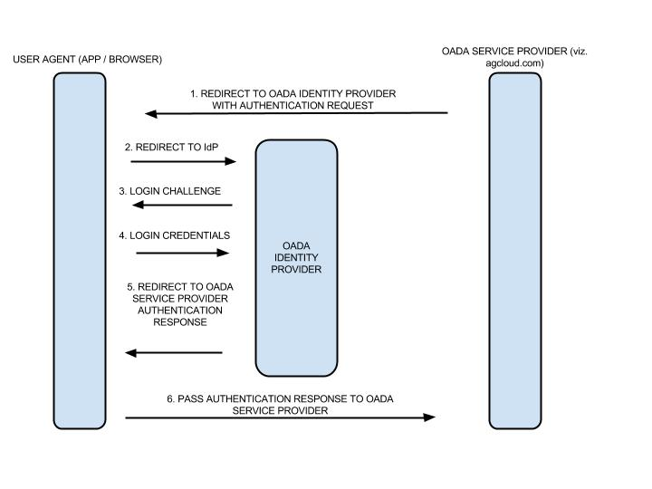

# OADA Federated Identity

The OADA ecosystem is made of many entities, such as, applications, cloud
providers, identity providers, and devices. They all communicate with each
other using OADA'a open REST API. In particular, the REST API enables an end
user to not only leverage a broad spectrum of service providers for their own
data but also for the data of others, assuming, the other users have consented.
Such an architecture helps to guarantee that farmers and other agriculture
players remain in control of their own data even when accessed or created by a
third party.

OADA Federated Identity means that entities within the OADA ecosystem trust
anonymized assertions of a currently logged in user from one another. The
service can be also be used by clients and providers to automatically discover
personal information, such as, name, email, address, etc, but only if the end
user has consented to sharing this information. Therefore, one can fully
participate in the OADA community while choosing to remain anonymous to service
providers. Federated Identity does not mean that any OADA entity can access or
control a OADA user profile. In fact, only the Federated Identity Provider,
selected by the end user themselves, can access and control the data stored in
the profile. An Identity Provider may not release any profile data without
explicit permission from the end user for each and every share.

For example, if Andy, known as andy@agidentity.com, is using an application
hosted on agronomists.com and wants to access data that Frank shared with him
(via his andy@agidentity.com identity) on agcloud.com, Andy must simply assert
his andy@agidentity.com identity to AgCloud. Andy can access the on agcloud.com
without have ever creating an account with AgCloud. Just to be clear, Federated
Identity does not imply creation of new identities for existing users. Just the
assertion of existing identities to an OADA entity that is not their provider.

In the absence of required Federated identity, consultants who interact with
many farmers would either need:

* accounts on every OADA cloud that their customers use
* or temporary tokens sent through email by their customers

## OADA Identity Federation

OADA Identity Federation is made up of entities that have decided to accept
identity assertions from one another. The membership list is currently
maintained by OADA but may be managed by an independent third party in the
future. OADA Identity Federation Membership implies:

* The right to assert identities to other entities without security warnings to
the end user
* The responsibility to abide by certain practices on data security and privacy
(details to be determined)

OADA federation membership does not automatically grant access to user’s data.
The end user remains the ultimate arbitrar on who can access his or her data.

## Technical Requirements

OADA does not standardize user login screens or processes. However, it does
require cloud providers to support the standard OAuth 2.0 and
oada-configuration well-known endpoints. Identity providers must support
standard OpenID Connect and openid-configuration well-known endpoints. All
providers should support discovering clients from their client id using OADA
client discovery. Provider can using the client discovery to verify that a
client has agreed to a sufficient terms-of-use or license.

### Summarizing

* A list of trusted identity providers is currently maintained and served
securely by OADA but it may be managed by an independent third party in the
future.
* OADA-compliant cloud providers and applications must accept identities from
these providers.
* OADA-compliant cloud providers are required to notify users if a given
identity assertion is from a non-OADA-trusted identity provider. The cloud
provider may choose to not accept such assertions altogether.

## Terminology

* End User
  * End user is an actual person depending on the context: i.e. a farmer, farm
manager, agronomist, consultant etc.
* Cloud
  * OADA Cloud provides data storage and any other services through the OADA
API.
* Service Provider
  * An OADA compliant application like a prescription map generator, agronomy
application etc.
* Identity Provider
  * An OADA entity that can verify an end-user’s identity. This is typically an 
entity with which an end user has an account. In OpenID Connect, this is the 
OpenID Provider (OP)
* Client
  * Generic term for software acting as a service provider, device, or an
application.
* User agent
  * An entity like a web browser or a web engine that handles the HTTP
directives like redirects, sometimes seamlessly without a controlling layer.
* Frank
  * Farmer, typically owns data in question, but not always.
* Andy
  * Agronomist, typically provides advice and prescriptions to Frank. Andy may own his own data.
* agcloud.com
  * Cloud storage provider. May or not be an identity provider.
* agronomists.com
  * Service provider. May or may not be an identity provider.
* farmeridentity.com
  * Frank’s identity provider.
* agronomistidentity.com
  * Andy’s identity provider.

## Federated Identity Example - User Login

**Goal:** Frank logs into an AgCloud browser application using his
FarmerIdentity OADA identity.

1. Frank opens AgCloud's browser application and is presented with a login
screen.

2. Frank selects `Login with OADA Federated Identity`.

3. AgCloud's login screen prompts Frank for his preferred OADA Federated
Identity provider.

4. Frank enters `farmeridentity.com` and selects `Login`.

5. AgCloud's verifies `farmeridentity.com` is on the OADA trusted list and
discovers its identity endpoints by downloading FarmerIdentity's
`openid-configuration` document.

6. A standard OpenID Connect flow occurs between AgCloud and FarmerIdentity.

7. Frank successfully logs into FarmerIdentity with `frank@farmeridentity.com`.

8. FarmerIdentity confirms that Frank wants to share his identity with AgCloud.

9. FarmerIdentity asserts Frank's identity using an anonymized account id to
AgCloud.

10. AgCloud allows Frank access to the application.

## Federated Identity Example - Gain an OADA REST API Token

**Goal:** Andy uses Agronomists's browser application to access Frank's data in
AgCloud. Frank uses its Agronomists Federated Identity to log into AgCloud.

1. Andy points Agronomists's browser application to AgCloud OADA cloud to
access Frank's data.

2. Agronomists's application discovers AgCloud OADA endpoints by downloading
its `oada-configuration` document.

3. Agronomists's initiates an OAuth 2.0 flow with AgCloud.

4. AgCloud present's Andy with a login screen.

5. Andy selects `Login with OADA Federated Identity`.

6. AgCloud's login screen prompts Andy for his preferred OADA Federated
Identity provider.

7. Frank enters `agronomistidentity.com` and selects `Login`.

8. AgCloud's verifies `agronomistidentity.com` is on the OADA trusted list and
discovers its identity endpoints by downloading AgronomistIdentity's
`openid-configuration` document.

9. A standard OpenID Connect flow occurs between AgCloud and
AgronomistIdentity.

10. Andy successfully logs into AgronomistIdentity with
`andy@agronomistidentity.com`.

11. AgronomistIdentity confirms that Andy wants to share his identity with
AgCloud.

12. AgronomistIdentity asserts Frank's identity using an anonymized account id
to AgCloud.

13. AgCloud confirms that Andy wants to allow Agronomists's application to
access his data (Frank's shared data) in AgCloud.

14. AgCloud generates a token or code depending on the particular OAuth 2.0
flow in use and responds with standard OAuth 2.0.

15. Andy’s client uses the OADA REST API with OAuth 2.0 newly gained access
token to access Frank’s data.

# Federated Identity Architecture

This section provides a brief description of the key concepts and the
components defined in the standard, as they relate to OADA federated identity.
OADA Identity Providers support federated identity using Open ID Connect 
(ODIC) [[1][oidc]]. OpenID Connect 1.0 is a simple identity layer on top of 
the OAuth 2.0 protocol. It allows Clients to verify the identity of the End-User
based on the authentication performed by an Authorization Server, as well as to
obtain basic profile information about the End-User in an interoperable and
REST-like manner.

The OADA ecosystem will contain multiple identity providers for the community
to rely on. Those providers that are OADA-Federated-Identity-Compliant and
follow acceptable security practice will be added to the OADA trusted list.
Federated Identity providers may also simultaneously be a cloud provider,
however they are not a required to be.

## Basic Concepts

OADA federated identity exchange takes place between system entities referred
to as an OADA identity provider and OADA service provider. What is typically
exchanged are assertions / tokens.

At the heart of OADA federated identity exchange is an assertion about a
subject (a principal – an entity that can be authenticated – within the context
of a particular security domain) about which something is being asserted. The
subject could be a human but could also be some other kind of entity, such as a
software application.

A typical assertion from an identity provider might convey information such as
“This user is John Doe, he has an email address of john.doe@example.com, and he
was authenticated into this system using a password mechanism.” A service
provider could choose to use this information, depending on its access
policies, to grant John Doe access to various resources.

## Federated Identity Workflow

OADA Federated Identity is implemented using Open ID Connect (ODIC).

1. An end user (via an application / browser, henceforth called user agent)
takes some action which prompts the need for an identity verification and/or
access token generation. Therefore, an OADA entity (viz. agcloud.com) redirects
the user to an OADA Identity provider’s (viz. farmeridentity.com or
agronomistidentity.com) authentication endpoint with a specific request.
2. The end user's user agent carries out the redirect request.
3. The authentication endpoint then presents the end user with some sort of
login challenge. Typically this is a web page which asks for credentials and
the user's permission to authorize the requested scope. If the Identity
Provider can and is allowed to determine the user identity without credentials,
such as current and active session, then it may only ask for the user to
authorize the requested scope. If the end user has previously authorized the
requested scope and has a current and active session then the Identity Provider
may not require any user interaction.
4. The end user successfully completes the login challenge and provides the
necessary authorization.
5. The OADA identity provider’s authentication endpoint redirects the end user
back to the OADA entity that initiated the authentication request (viz.
agcloud.com).

| OADA Entity | ODIC Entity |
| ----------- | ----------- |
| OADA Service Provider | Relying Party |
| OADA Identity Provider | OpenID Provider |

## Establishing and Managing Federated Identities

A user’s identity is said to be “federated between a set of entities” when
there is an agreement between the entities on a set of identifiers and/or
identity attributes by which the entities will refer to the user.

Here are some basic considerations when OADA entities decide to use federated
identities to share security and identity information about users:

* Do the users have existing local identities at OADA entities (identity
providers to be specific) that must be linked together through the federated
identifiers?
    * Most identity management systems maintain local identities for users.
These local identities might be represented by the user's local login account
or some other locally identifiable user profile. These local identities must be
linked to the federated identity that will be used to represent the user when
the provider interacts with another OADA entity.  The process of associating a
federated identifier with the local identity at a partner (or partners) where
the federated identity will be used is often called account linking.

* Will the establishment and termination of federated identifiers for the users
be done dynamically or will OADA entities use pre-established federated
identifiers?
    * While OADA entities are free to pre-establish some sort of mechanism like
an “identity feed” between themselves, most of the time establishment and
termination of federated identifiers will be a dynamic process.
* Do users need to explicitly consent to establishment of the federated
identity?
  * Yes.
* Do identity attributes about the users need to be exchanged?
  * In order for a service provider (viz. agcloud.com) to be fully aware of the
user / entity seeking resource access, we require that actual identity
attributes (user name etc) be exchanged.
* Should the identity federation rely on transient identifiers that are
destroyed at the end of the user session?
    * We recommend that transient identifiers be destroyed at the end of a user
session.
* Is the privacy of information to be exchanged of high concern such that the
information should be encrypted?
  * Just providing assertions from an identity provider to a service provider
may not be adequate to ensure a secure system. How does the service provider
trust what is being asserted to it? In addition, what prevents a
“man-in-the-middle” attack that might grab assertions to be illicitly
“replayed” at a later date?  OIDC defines a number of security
mechanisms to detect and protect against such attacks. OIDC recommends
HTTP over SSL 3.0 or TLS 1.0 to assure message integrity and confidentiality.

# References

1. [OpenID Connect (OIDC)][oidc]
 
[oidc]: http://openid.net/connect/
