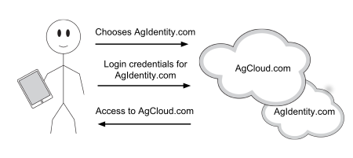
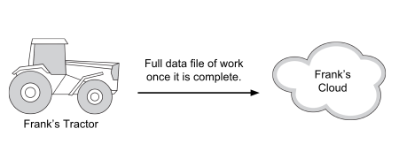
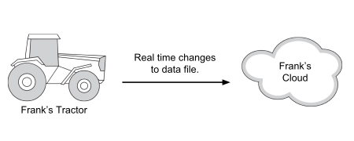
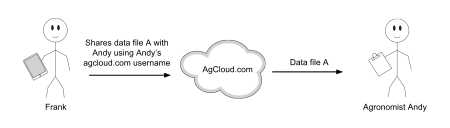
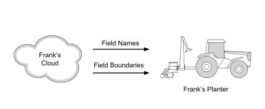
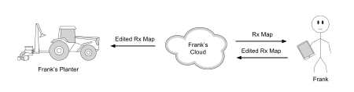
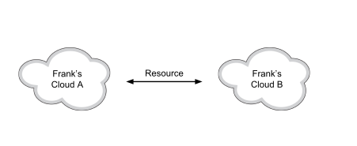

# OADA REST API Examples

## Characters
To better convey what each example is accomplishing we describe them with
several fictitious characters. You have probably seen them scattered throughout
OADA publications, but just in below is a quick reminder of them.

* **Frank**
    * Is a farmer.
    * Stores his data in agcloud.com.
    * Uses a federated identity from farmeridentity.com.
    * Has an OADA compliant telematics device.
    * Has OADA compliant apps on his Android tablet.
* **Andy**
    * Is a agronomist.
    * Wants to access Frank's data at agcloud.com.
    * Uses a federated identity from agronomistidentity.com

# Examples

* [Federated Login](#federated-login)
* [JSON Resource Upload](#json-resource-upload)
* [Binary Resource Upload](#binary-resource-upload)
* [Resource Update](#resource-update)
* [Resource Sharing](#resource-sharing)
* [Field Discovery](#field-discovery)
* [Manual Resource Syncing](#manual-resource-syncing)
* [Automatic Resource Syncing](#automatic-resource-syncing)
* [View Changes](#view-changes)
* [View Changes for a Resource and Its Children](#view-changes-for-a-resource-and-its-children)
* [More View Examples](View-Proposal.md#examples)
* [Copy Resource](#copy-resource)
* [Make Existing Resource a Derivative of Another](#make-existing-resource-a-derivative-of-another)

# Federated Login



Frank logs into his agcloud.com OADA account with an OADA compliant Android app
using his farmeridentity.com federated identity.

To begin the process Frank's app discovers the authorization endpoints and
agcloud.com's OADA base URI by issuing a GET request on the
.well-known/oada-configuration URI.

**Request**
```http
GET /.well-known/oada-configuration HTTP/1.1
Host: agcloud.com
Accept: application/json
```

**Response**
```http
HTTP/1.1 200 OK
Content-Type: application/json

{
  "authorization_endpoint": "http://api.agcloud.com/authorize",
  "token_endpoint": "http://api.agcloud.com/token",
  "oada_base_uri": "https://api.agcloud.com",
  "client_discovery": "https://api.agcloud.com/clientDiscovery"
}
```

The second step is to start the OAuth 2.0 procedure by making an implicit flow
request to the specified `authorization_endpoint`. Implicit flow is used because
it makes most sense for an Android app. However, other OAuth 2.0 flows may be
used.

**Request**
```http
GET /authorize?response_type=token&client_id=s6BhdRkqt3%40agidentity.com&state=xyz&redirect_uri=https%3A%2F%2Flocalhost HTTP/1.1
Host: api.agcloud.com
Accept: text/html,application/xhtml+xml,application/xml
```

**Response**
```http
HTTP/1.1 200 OK
Content-Type: text/html

<html>
...
</html>
```

Agcloud.com's response is an HTML page that challenges Frank to login with local
user credentials or an OADA federated identity.

Frank elects to login with the OADA federated identity
`frank@farmeridentity.com` and therefore his user-agent  generates a GET request
back to agcloud.com.  If farmeridentity.com's OpenId Connect endpoint is unknown
to agcloud.com then it queries
`farmeridentity.com/.well-known/openid-configuration` to discover the correct
URL.

**Request**
```http
GET /.well-known/openid-configuration HTTP/1.1
Host: farmeridentity.com
Accept: application/json
```

**Response**
```http
HTTP/1.1 200 OK
Content-Type: application/json

{
  "issuer": "https://farmeridentity.com",
  "authorization_endpoint": "https://farmeridentity.com/oada/fed/auth",
  "token_endpoint": "https://farmeridentity/oada/fed/token",
  "userinfo_endpoint": "https://farmeridentity/oada/fed/userInfo",
  "jwks_uri": "https://farmeridentity.com/oada/fed/certs",
  "response_types_supported": [
    "code",
    "token",
    "id_token",
    "code token",
    "code id_token",
    "token id_token",
    "code token id_token"
  ],
  "subject_types_supported": [
    "public"
  ],
  "id_token_alg_values_supported": [
    "RS256"
  ],
  "token_endpoint_auth_methods_supported": [
    "client_secret_post"
  ]
}
```

Once the correct URL is known, agcloud.com responds to the above user-agent GET
request with a redirect to the OpenID Connect endpoint. This begins the  OpenID
Connect flow.

**Response**
```http
HTTP/1.1 302 Found
Location: https://farmeridentity.com/authorize?response_type=id_token%20token&client_id=s6BhdRkqt3%40agidentity.com&redirect_uri=https%3A%2F%2Fapi.agcloud.com%2Fcb&scope=openid%20profile&state=af0ifjsldkj&nonce=n-0S6_WzA2Mj HTTP/1.1
```

Therefore, Frank's user-agent makes a GET request to farmeridentity.com

**Request**
```http
GET /authorize?response_type=code&client_id=s6bhdrkqt3%40agidentity.com&redirect_uri=https%3a%2f%2fapi.agcloud.com%2fcb&scope=openid%20profile HTTP/1.1
Host: farmeridentity.com
Accept: text/html,application/xhtml+xml,application/xml
```

**Response**
```http
HTTP/1.1 200 OK
Content-Type: text/html; charset=UTF-8

<html>
...
</html>
```

farmeridentity.com's response is an HTML page that challenges Frank to login
with his local user credentials, in this case the account of Frank's federated
identity.

After a successfully log in Frank is asked if agcloud.com is allowed to access
his profile information, e.g., real name, email, etc. When Frank agrees
farmeridentity.com issues a redirect response back to agcloud.com.

**Response**
```http
HTTP/1.1 302 Found
Location: https://api.agcloud.com/cb?code=SplxlOBeZQQYbYS6WxSbIA&state=af0ifjsldkj
```

Frank's user-agent makes the redirect GET request and therefore completes the
OpenId Connect flow. The original OAuth 2.0 resumes.

**Request**
```http
GET /cb?code=SplxlOBeZQQYbYS6WxSbIA&state=af0ifjsldkj HTTP/1.1
Host: api.agcloud.com
Accept: text/html,application/xhtml+xml,application/xml
```

In the background, agcloud.com communicates with farmeridentity.com using
standard OpenID Connect protocol to retrieve the actual `id_token` that asserts
Frank's identity and a JSON document which contains Frank's personal profile
information.

When agcloud.com validates the `id_token` Frank is considered logged as the
identity `frank@agidentity.com` and an OAuth 2.0 token is generated.

Agcloud.com responds to the above GET request with a redirect that includes the
generated token.

**Response**
```http
HTTP/1.1 302 Found
Location: https://localhost#access_token=SlAV32hkKG&token_type=bearer&expires_in=3600&state=af0ifjsldkj
```

Finally, the Android app parses the `access_token` from the Location URI
fragment and stores it for later use.

# JSON Resource Upload



Frank's telematics device records yield measurements throughout an entire day as
a GeoJSON file. Just before Frank finishes his work for the day he touches the
"sync to OADA cloud" button.  As a result, Frank's telematics device uploads the
entire GeoJSON file as a new resource to Frank's agcloud.com.

**Assumptions**

* The telematics device already has authorization and a valid token
  (SlAV32hkKG).

**Request**
```http
POST /resources HTTP/1.1
Host: api.agcloud.com
Authentication: Bearer SlAV32hkKG
Content-Type: application/vnd.oada.yield+json

{
  "totalYield": {
    "value": 5.6,
    "unit": "bushel"
  },
  "type": "FeatureCollection",
  "bbox": [40.42426718029455, 40.42429718029455, -86.841822197086, -86.841852197086],
  "features": [{
      "....": "...."
  }],
  "_meta": {
    "meta": {
      "name": "Frank's Yield"
    }
  }
}
```

**Response**
```http
HTTP/1.1 201 Created
Location: /resources/ixm24ws
Content-Type: application/vnd.oada.yield+json
Etag: "9083423jkadfu9382x"

{
  "totalYield": {
    "value": 5.6,
    "unit": "bushel"
  },
  "type": "FeatureCollection",
  "bbox": [40.42426718029455, 40.42429718029455, -86.841822197086, -86.841852197086],
  "features": [{
      "....": "...."
  }],
  "_meta": {
    "_id": "ixm24ws/_meta",
    "etag": "alsjfadksja9388x7d",
    "changeId": 1,
    "mimeType": "application/vnd.oada.yield+json",
    "created": "1985-04-12T23:20:50.52Z",
    "createdBy": {
      "_id": "ixm24ws/_meta/createdBy"
    },
    "modified": "1985-04-12T23:20:50.52Z",
    "modifiedBy": {
      "_id": "ixm24ws/_meta/modifiedBy"
    },
    "meta": {
      "_id": "ixm24ws/_meta/meta",
      "name": "Frank's Yield"
    },
    "formats": {
      "_id": "ixm24ws/_meta/formats"
    },
    "parents": {
      "_id": "ixm24ws/_meta/parents"
    },
    "children": {
      "_id": "ixm24ws/_meta/children"
    },
    "derivatives": {
      "_id": "ixm24ws/_meta/derivatives"
    },
    "permissions": {
      "_id": "ixm24ws/_meta/permissions"
    },
    "derivatives": {
      "_id": "ixm24ws/_meta/derivatives"
    }
  }
}
```

Because `_meta` was given in the original POST request the response assumed that
the view for `_meta` should implicitly be truthy. If the original POST contained
only the native document, then only the native document would have been
returned.

# Binary Resource Upload


Frank's telematics device records yield measurements throughout the entire day
as a shape file. Just before Frank finishes his work for the day he touches the
"sync to OADA cloud" button.  As a result, Frank's telematics device uploads the
entire shape file as a new resource to Frank's agcloud.com.

**Assumptions**

- The telematics device already has authorization and a valid token
  (SlAV32hkKG).

To set the new resource's metadata  and upload the associated data
simultaneously a POST request with the header `Content-Type:
multipart/form-data` is made. The JSON metadata document is sent with the
form-data named `metadata` and the data with form-data named `data`.

**Request**
```http
POST /resources HTTP/1.1
Host: api.agcloud.com
Authentication: Bearer SlAV32hkKG
Content-Type: multipart/form-data; boundary=AaB03x

--AaB03x
Content-Disposition: form-data; name="metadata"
Content-Type: application/json

{
  "_meta": {
    "meta": {
      "name": "Frank's Yield"
    }
  }
}

--AaB03x
Content-Disposition: form-data; name="data"
Content-Type: application/shape

...binary data...
```

**Response**
```http
HTTP/1.1 201 Created
Location: /resources/Kcdi32S
Content-Type: multipart/mixed; boundary="Ox6Csz";

--Ox6Csz
Content-Disposition: form-data; name="metadata"
Content-Type: application/vnd.oada.metadata+json

{
  "_meta": {
    "_id": "Kcdi32S/_meta",
    "etag": "JzlCjsjaljcaw8723x",
    "changeId": 1,
    "mimeType": "application/shape",
    "created": "1985-04-12T23:20:50.52Z",
    "createdBy": {
      "_id": "Kcdi32S/_meta/createdBy"
    },
    "modified": "1985-04-12T23:20:50.52Z",
    "modifiedBy": {
      "_id": "Kcdi32S/_meta/modifiedBy"
    },
    "meta": {
      "_id": "Kcdi32S/_meta/meta",
      "name": "Frank's Yield"
    },
    "formats": {
      "_id": "Kcdi32S/_meta/formats"
    },
    "parents": {
      "_id": "Kcdi32S/_meta/parents"
    },
    "children": {
      "_id": "Kcdi32S/_meta/children"
    },
    "derivatives": {
      "_id": "Kcdi32S/_meta/derivatives"
    },
    "permissions": {
      "_id": "Kcdi32S/_meta/permissions"
    },
    "derivatives": {
      "_id": "Kcdi32S/_meta/derivatives"
    }
  }
}

--Ox6Csz
Content-Disposition: form-data; name="data"
Content-Type: application/shape

...binary data...
```
Because `_meta` was given in the original POST request the response assumed that
the view for `_meta` should implicitly be truthy. If the original POST contained
only the native document, then only the native document would have been
returned.

# Resource Update



Whenever Frank's tractor is on, his telematics device records the number of
hours it has been running. Periodically, the telematics device updates a tractor
status resource in Frank's agcloud.com with the new total runtime.

**Assumptions**

- The tractor status resource already exists (Resource ID: kdj83mx).
- The telematics device already has authorization and a valid token
  (SlAV32hkKG).

**Request**
```http
GET /resources/kdj83mx HTTP/1.1
Host: api.agcloud.com
Authentication: Bearer SlAV32hkKG
Accept: application/json
```

**Response**
```http
HTTP/1.1 200 OK
Content-Type: application/json
Etag: "686897696a7c876b7e"

{
  "hours": 1523,
  "fuel_level": "80%",
  "service_intervals": {
    "50_hour": -4,
    "100_hour": 46
  }
}
```

The telematics device wants to update the `hours` field to `1524`. It will also
update the `service_intervals` to `-5` and `46` for `50_hour` and `100_hour`
respectively.

This can be accomplished several ways.

## With PUT

**Request**
```http
PUT /resources/kdj83mx HTTP/1.1
Host: api.agcloud.com
Authentication: Bearer SlAV32hkKG
Content-Type: application/json
If-Match: "686897696a7c876b7e"

{
  "hours": 1524,
  "fuel_level": "80%",
  "service_intervals": {
    "50_hour": -5,
    "100_hour": 45
  }
}
```

Notice the `If-Match` header provides concurrency protection. That is the PUT
will fail if the document has changed since the initial GET.

**Response**
```http
HTTP/1.1 200 OK
Content-Type: application/json
Etag: "893rjdklia9w383984"

{
  "hours": 1524,
  "fuel_level": "80%",
  "service_intervals": {
    "50_hour": -5,
    "100_hour": 45
  }
}
```

## With two separate puts to update each section of the document independently

*Unless the application carefully considers concurrency issues this method may
result in a inconsistent document.*

**Request**
```http
PUT /resources/kdj83mx/hours HTTP/1.1
Host: api.agcloud.com
Authentication: Bearer SlAV32hkKG
Content-Type: plain/text

1524
```

**Response**
```http
HTTP/1.1 200 OK
Content-Type: plain/text
Etag: "asf9cka3a08345rjj4"

1524
```

**Request**
```http
PUT /resources/kdj83mx/service_intervals HTTP/1.1
Host: api.agcloud.com
Authentication: Bearer SlAV32hkKG
Content-Type: application/json
If-Match: "asf9cka3a08345rjj4"

{
  "50_hour": -5,
  "100_hour": 45
}
```

**Response**
```http
HTTP/1.1 200 OK
Content-Type: application/json
Etag: "893rjdklia9w383984"

{
  "50_hour": -5,
  "100_hour": 45
}
```

## With PATCH

**Request**
```http
PATCH /resources/kdj83mx HTTP/1.1
Host: api.agcloud.com
Authentication: Bearer SlAV32hkKG
Content-Type: application/json
If-Match: "686897696a7c876b7e"

{
  "hours": 1524,
  "service_intervals": {
    "50_hour": -5,
    "100_hour": 45
  }
}
```

**Response**
```http
HTTP/1.1 200 Ok
Content-Type: application/json
Etag: "893rjdklia9w383984"

{
  "hours": 1524,
  "fuel_level": "80%",
  "service_intervals": {
    "50_hour": -5,
    "100_hour": 45
  }
}

```

# Resource Sharing



Frank instructs his OADA complaint Android app to share a resource with Andy.
Now Andy can access it directly with his own account.

**Assumptions**

- Frank's Android app already has authorization and a valid token for Frank's
  agcloud.com user (SlAV32hkKG).
- Andy's OADA application already has authorization and a valid token for Andy's
  agcloud.com user (kaJH38da3x).

To share `/resources/ixm24ws`, the GeoJSON yield resource created earlier, with
Andy as an owner, `userId = jdx83jx`, a new entry to the resource's permission
document must be added.

**Request**
```http
POST /resources/ixm24ws/_meta/permissions HTTP/1.1
Host: api.agcloud.com
Authentication: Bearer SlAV32hkKG
Content-Type: application/json

{
  "user": {
    "_id": "jdx83jx"
  },
  "type": "user",
  "level": "owner"
}
```

**Response**
```http
HTTP/1.1 201 Created
Content-Type: application/json
Location: /resources/ixm24ws/_meta/permissions/9mxjs7c
Etag: "xJDS9fd8f2838fxay4"

{
  "user": {
    "_id": "jdx83jx"
  },
  "type": "user",
  "level": "owner"
}
```

Now Andy can access the resource with his identity.

**Request**
```http
GET /resources/ixm24ws HTTP/1.1
Host: api.agcloud.com
Authentication: Bearer kaJH38da3x
Accept: application/json

```

**Response**
```http
HTTP/1.1 200 OK
Content-Type: application/json
Etag: "aodskjfoa3j9af7883"

{
  "totalYield": {
    "value": 5.6,
    "unit": "bushel"
  },
  "type": "FeatureCollection",
  "bbox": [40.42426718029455, 40.42429718029455, -86.841822197086, -86.841852197086],
  "features": [{
      "....": "...."
  }]
}
```

# Field Discovery



Frank drives his tractor to a field and starts planting. Instead of asking Frank
what field he is in, the monitor automatically discovers the current set of
fields using the fields bookmark on Frank's agcloud.com storage.  However, the
resource is in the Shape format but the monitor only understands GeoJSON.
Therefore, the monitor requests a Shape to GeoJSON transformation.

**Assumptions**

- Frank's monitor device already has authorization and a valid token
  (SlAV32hkKG).

The fields resource is located via the field bookmark.

**Request**
```http
GET /bookmarks/fields HTTP/1.1
Host: api.agcloud.com
Authentication: Bearer SlAV32hkKG
Accept: application/json

```

**Response**
```http
HTTP/1.1 200 OK
Content-Type: application/json
Etag: "aodskjfoa3j9af7883"

{
  "_id": "fd8as8c"
}
```

Now that the fields resource is known, Frank's monitor must consult the formats
metadata document to determine if the fields can be returned in an acceptable
format. In this case the desired format is `application/vns.oada.fields+json`.

**Request**
```http
GET /resources/fd8as8c/_meta/formats HTTP/1.1
Host: api.agcloud.com
Authentication: Bearer SlAV32hkKG
Accept: application/json
```

**Response**
```http
HTTP/1.1 200 OK
Content-Type: application/json
Etag: "qewriuquicjdkcj832"

{
  "_id": "fd8as8c/_meta/formats",
  "etag": "qewriuquicjdkcj832",
  "transforms": {
    "application/vnd.oada.field+json": {
      "original": true,
      "lossy": false,
      "name": "OADA GeoJSON Field Open Format",
      "openFormat": true
    },
    "application/shape": {
      "lossy": false,
      "name": "Esri Shapefile",
      "openFromat": false
    }
  }
}
```

`application/vnd.oada.field+json` is present in the `transforms` key and AgCloud
can transform the native file into the desired format via a GET request `Accept`
header.

**Request**
```http
GET /resources/fd8as8c HTTP/1.1
Host: api.agcloud.com
Authentication: Bearer SlAV32hkKG
Accept: application/vnd.oada.field+json
```

**Response**
```http
HTTP/1.1 200 Ok
Content-Type: application/vnd.oada.field+json
Etag: "qewriuquicjdkcj832"

{
  "type": "GeometeryCollection",
  "...": "...",
  "features": [{
    "...": "..."
  }],
  "...": "..."
}
```

# Manual Resource Syncing



Frank uses an OADA compliant Android app to discover his planting prescription
resource via the prescription bookmark. He proceeds to edit it and sync it back
to agcloud.com. This same prescription resource was previously discovered and
downloaded by Frank's monitor.  However, to stay synchronized the monitor
periodically checks the agcloud.com for changes to the resource.

**Assumptions**

- Frank's monitor device already has authorization and a valid token
  (SlAV32hkKG).
- Both the Android app and monitor have already discovered and downloaded the
  prescription resource. The discovered resource ID is `ajd82mx` and the
  original Etag was `k23odjuasidfjasdkf`.

Update polls can be accomplished by issuing GET requests with `If-None-Match`
headers periodically.

**Request**
```http
GET /resources/fd8as8c HTTP/1.1
Host: api.agcloud.com
Authentication: Bearer SlAV32hkKG
Accept: application/vnd.oada.prescription.planting+json
If-None-Match: "k23odjuasidfjasdkf"

```

Typically the response will be one of following two

*No changes*

**Response**
```http
HTTP/1.1 304 Not Modified
Content-Type: application/json
Etag: "k23odjuasidfjasdkf"

```

*Changes Available*

**Response**
```http
HTTP/1.1 200 OK
Content-Type: application/json
Etag: "ajja97823jfaksdhfx"

{
  "...": "..."
}
```

# Automatic Resource Syncing



Frank stores the same resource in two different OADA implementations. Frank
wants the two copies to stay synchronized with each other automatically.

**Assumptions**

* Frank uses both openag.io and agcloud.com OADA cloud services.
* The resources being synchronized are known as
  `http://api.agcloud.com/resources/ajd82mx` and
  `http://api.openag.io/resources/xl2nfd0`
* openag.io is capable of receiving push notifications at
  https://api.openag.io/notifications.
* agcloud.com is capable of receiving push notifications at
  https://api.agcloud.com/notifications.

Synchronization of the resources is accomplished by establishing either a push
or poll sync between both clouds, in both directions.

*"poll" synchronization between both clouds*

**Request - api.agcloud.com**
```http
POST /resources/ajd82mx/_meta/syncs HTTP/1.1
Host: api.agcloud.com
Authentication: Bearer SlAV32hkKG
Content-Type: application/json

{
  "type": "poll",
  "url": "http://api.openag.io/resources/xl2nfd0",
  "headers": {},
  "interval": 3600,
  "authorization": {
    "_id": "8ackam3"
  }
}
```

**Response**
```http
HTTP/1.1 200 OK
Location: resources/ajd82mx/_meta/syncs/xjf3ft6
Content-Type: application/json
Etag: "zjalkwjc3ldsua43ir"

{
  "type": "poll",
  "url": "http://api.openag.io/resources/xl2nfd0",
  "headers": {},
  "lastChangeId": "uc47fcs",
  "interval": 3600,
  "authorization": {
    "_id": "8ackam3"
  }
}
```

**Request - api.openag.io**
```http
POST /resources/xl2nfd0/_meta/syncs HTTP/1.1
Host: api.openag.io
Authentication: Bearer SlAV32hkKG
Content-Type: application/json

{
  "type": "poll",
  "url": "http://api.agcloud.com/resources/ajd82mx",
  "headers": {},
  "interval": 3600,
  "authorization": {
    "_id": "3dcif83"
  }
}
```

**Response**
```http
HTTP/1.1 200 OK
Location: /resources/xl2nfd0/_meta/syncs/8dkvf4r
Content-Type: application/json
Etag: "kdjvjklasfje498u39"

{
  "type": "poll",
  "url": "http://api.agcloud.com/resources/ajd82mx",
  "headers": {},
  "lastChangeId": "fur4cxs5",
  "interval": 3600,
  "authorization": {
    "_id": "3dcif83"
  }
}
```

*"push" synchronization between both clouds*

**Request - api.agcloud.com**
```http
POST /resources/ajd82mx/_meta/syncs HTTP/1.1
Host: api.agcloud.com
Authentication: Bearer SlAV32hkKG
Content-Type: application/json

{
  "type": "push",
  "url": "http://api.openag.io/notifications",
  "headers": {},
  "events": ["change"],
  "authorization": {
    "_id": "8ackam3"
  }
}
```

**Response**
```http
HTTP/1.1 200 OK
Location: resources/ajd82mx/_meta/syncs/xjf3ft6
Content-Type: application/json
Etag: "zjalkwjc3ldsua43ir"

{
  "type": "push",
  "url": "http://api.openag.io/notifications",
  "headers": {},
  "events": ["change"],
  "authorization": {
    "_id": "8ackam3"
  }
}
```

**Request - api.openag.io**
```http
POST /resources/xl2nfd0/_meta/syncs HTTP/1.1
Host: api.openag.io
Authentication: Bearer SlAV32hkKG
Content-Type: application/json

{
  "type": "push",
  "url": "http://api.agcloud.com/notifications",
  "headers": {},
  "events": ["changed"],
  "authorization": {
    "_id": "3dcif83"
  }
}
```

**Response**
```http
HTTP/1.1 200 OK
Location: /resources/xl2nfd0/_meta/syncs/8dkvf4r
Content-Type: application/json
Etag: "kdjvjklasfje498u39"

{
  "type": "push",
  "url": "http://api.agcloud.com/notifications",
  "headers": {},
  "events": ["changed"],
  "authorization": {
    "_id": "3dcif83"
  }
}
```

*One push and one poll*

It is possible to establish the synchronization by conducting polls in one
direction and pushes in the other. The documents for each sync type are the same
as the above examples.

# View Changes

Frank's file syncing application wants to discover all resources that have
changed since the last time it checked. The last time Frank's app checked it had
processed all changes up to and including the change id `6`.

*Decoded GET URI: /resources?view={"$each._meta.changeId":{"$gt":6}}*

**Request**
```http
GET /resources/%7B%22%24each._meta.changeId%22%3A%7B%22%24gt%22%3A6%7D%7D HTTP/1.1
Host: api.agcloud.com
Authentication: Bearer SlAV32hkKG

```

**Response**
```http
HTTP/1.1 200 OK
Content-Type: application/json

{
  "jc4dcx6": {
    "_id": "jc4dcx6"
  },
  "xj3jdc5": {
    "_id": "xj3jdc5"
  }
}
```

# View Changes for a Resource and Its Children

Frank's application wants to discover all changes that occurred to either the
given resource or any resource in its tree of children.

**Assumptions**

* Suppose Frank has a field resource reprented by the JSON below: 

```json
{
  "name": "Smith30",
  "acres": 30.3,
  "boundary": { <geojson-of-boundary-polygons> }
}
```

* Change ID `15` was the last changeId that Frank's app processed for the given 
resource but Andy just edited Smith30's field boundary. Franks's app needs to
poll the resource to see if it has changed.

*Decoded GET URI: /resources/ixm24ws?view={"_meta.changeId":{"$gt":15}}*

**Request**
```http
GET /resources/ixm24ws?view=%7B%22_meta.changeId%22%3A%7B%22%24gt%22%3A15%7D%7D HTTP/1.1
Host: api.agcloud.com
Authentication: Bearer SlAV32hkKG

```

**Response before changes**
```http
HTTP/1.1 200 OK
Content-Type: application/json

```

**Response after changes**
```http
HTTP/1.1 200 OK
Content-Type: application/json

{
  "name": "Smith30",
  "acres": 33.8,
  "boundary": { <geojson-of-boundary-polygons> }
}
```

# Copy Resource

Frank wants to make copy of a GeoJSON OADA yield resource but as a shape file.

This is accomplished by creating a new derivatives entry in the originating
resource.

**Request**
```http
POST /resources/ixm24ws/_meta/derivatives HTTP/1.1
Host: api.agcloud.com
Authentication: Bearer SlAV32hkKG
Content-Type: application/json

{
  "contentType": "application/shape",
  "parents": [{
    "_id": "jd983dc"
  }]
}
```

**Response**
```http
HTTP/1.1 201 Created
Content-Type: application/json
Location: /resources/ixm24ws/_meta/derivatives/jed82ar

{
  "contentType": "application/shape",
  "parents": [{
    "_id": "jd983dc"
  }]
}
```

# Make Existing Resource a Derivative of Another

Frank modified a shape file yield map resource using a non-OADA compliant
application. After uploading the result as a new resource he wants to make it a
derivative of the original.

This is accomplished by adding a derivatives entry to the originating resource.

**Request**
```http
POST /resources/ixm24ws/_meta/derivatives HTTP/1.1
Host: api.agcloud.com
Authentication: Bearer SlAV32hkKG
Content-Type: application/json

{
  "resource": {
    "_id": "fx3dfa3"
  }
}
```

**Response**
```http
HTTP/1.1 201 Created
Content-Type: application/json
Location: /resources/ixm24ws/_meta/derivatives/xjd83jf
Etag: "ckjlwj387fcakdfjk3"

{
  "contentType": "application/shape",
  "resource": {
    "_id": "fx3dfa3"
  }
}
```

